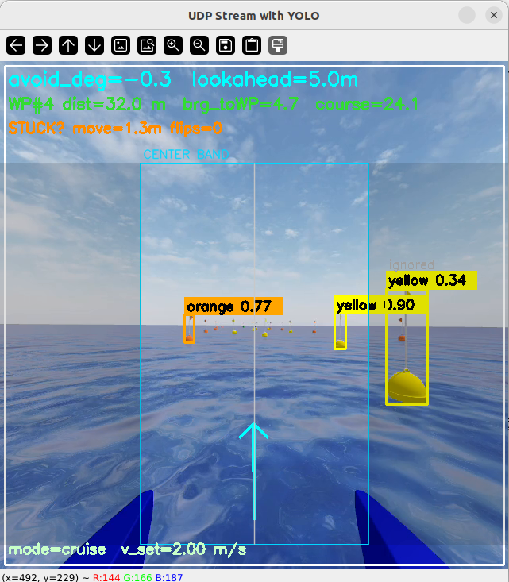

# IDA USV Autonomy

Gerçek zamanlı **YOLO** duba algılama + kaçınma, hat/koridor takibi ve **son WPT’de durup renk bekleme (COLOR WAIT)** özellikli otonom USV yazılımı.  
ArduPilot/SITL ile **MAVLink** (UDP 14551) üzerinden haberleşir, H264 **UDP video** (port 5600) akışını işler.

## Demo


---

## Özellikler (Özet)
- **Algılama:** YOLO + HSV/LAB renk füzyonu; sarı / turuncu / kırmızı / yeşil / siyah.
- **Kaçınma:** Koridor bandı, `avoid_deg`; **preempt / emergency / panic** tetik mantıkları.
- **Çatışma & Stuck:** İki taraf dolu → **conflict**, yerinde sayma → **bypass (kama)**.
- **Hat takibi:** Stanley kontrolü + **köşe kilidi**.
- **COLOR WAIT:** Son WPT’ye varınca **durup MAVLink’ten gelen rengi bekler**  
  (STATUSTEXT “COLOR: …”, NAMED_VALUE_INT / PARAM_VALUE `COLOR` / `RENK` (0..4)).

---

## Kurulum
```bash
python3 -m venv .venv
source .venv/bin/activate
pip install --upgrade pip
pip install -r requirements.txt


model = YOLO("/mutlak/yol/weights/best.pt")


source .venv/bin/activate
python src/ida_gorev.py
# Pencereden çıkış: q


ida-usv-autonomy/
├─ src/ida_gorev.py
├─ configs/
│  ├─ params_default.yaml
│  └─ waypoints_example.yaml
├─ docs/
│  ├─ IDA_Bilgilendirme_Dokumani_3KOhK-2.pdf
│  ├─ yeni.pdf
│  └─ media/
│     └─ surus.png
├─ scripts/run_sim.sh
├─ requirements.txt
└─ README.md


Kaçınma: ALPHA_AVOID, MAX_AVOID_DEG, CENTER_BAND

Tetikler: PREEMPT_TRIG_DIST_M, FRONT_TRIG_DIST_M, PANIC_TRIG_DIST_M, STOP_TTC_S

Hızlar: CRUISE_SPEED_MPS, AVOID_SPEED_MPS, PREEMPT_SPEED_MPS, EMERG_SPEED_MPS

Yakın WPT: NEAR_WP_R_M, GUARD_LOOKAHEAD_M

Stuck/BYPASS: STUCK_*, BYPASS_*
